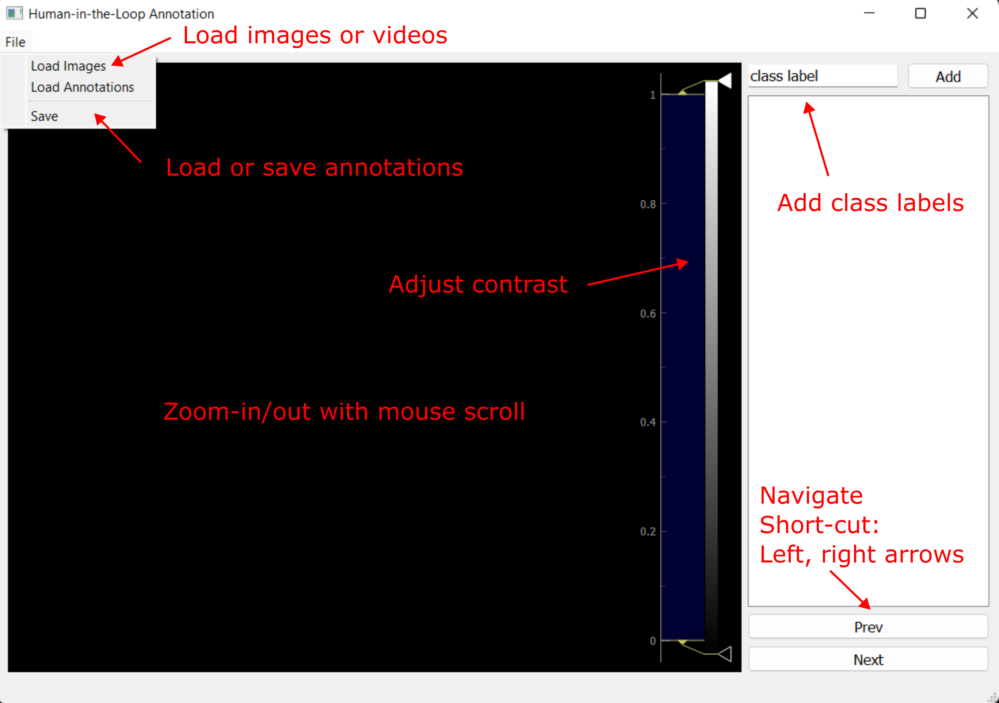

# Label GUI
Label-GUI is a lightweight graphical user interface based on PyQt5 and pyqtgraph for visualizing image or video data and creating semantic segmentation labels using [segment anything (SAM)](https://github.com/facebookresearch/segment-anything) from Meta AI Research. 

