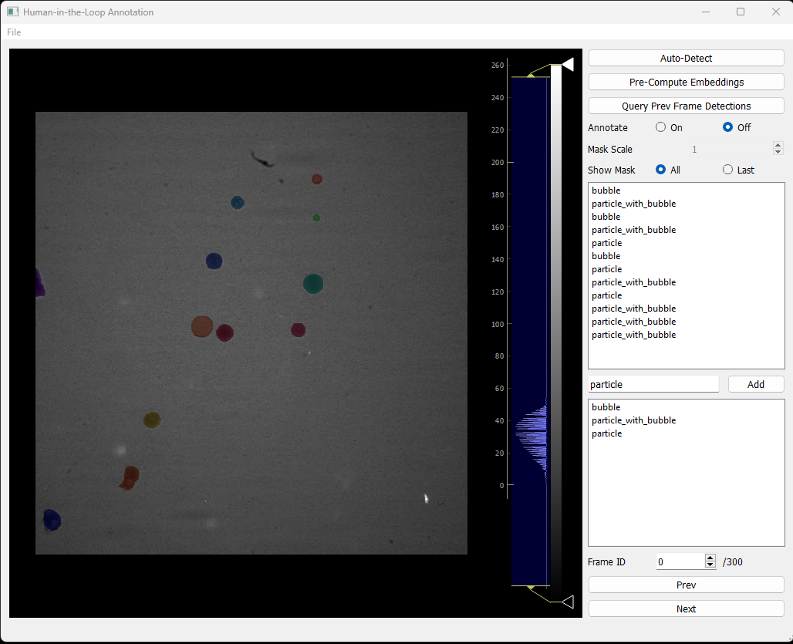

# Label GUI
Label-GUI is a lightweight graphical user interface based on PyQt5 and pyqtgraph for visualizing image or video data and creating semantic segmentation labels using [segment anything (SAM)](https://github.com/facebookresearch/segment-anything) from Meta AI Research. 



# Instructions
## Table of Contents
- [1. Installation](#installation)
- [2. Using Label-Gui](#using)
    - [2.1 Loading and Saving Data](#load_save)
    - [2.2 Image Viewer](#viewer)
    - [2.3 Histogram and Contrast Controls](#contrast)
    - [2.4 Controls](#controls)
    - [2.5 Keyboard Shortcuts](#summary)
- [3. TODO](#todo)

## 1. Installation <a name="installation"></a>
- Create a new conda environment called *label-gui* and activate it
    ```
    conda create -n label-gui python=3.10
    conda activate label-gui
    ```
- [Install Pytorch](https://pytorch.org/) with cuda (strongly recommended). Here is an example (as of April 2023; it might be different for your set-up):
    ```
    conda install pytorch torchvision pytorch-cuda=11.8 -c pytorch -c nvidia
    ```

- Download the latest release of Label-Gui from GitHub (**preferred**) or clone the repository.
    ```
    git clone https://github.com/velatkilic/label-gui.git
    ```

    Downloading the latest release is recommended because I might make breaking changes to the main branch.
- Navigate into the repository and install the required packages
    ```
    cd label-gui
    pip install -r requirements.txt
    ```
- Install Segment Anything (SAM) by following the instructions in [their GitHub repo](https://github.com/facebookresearch/segment-anything). As of April 2023, this entails:
    ```
    pip install git+https://github.com/facebookresearch/segment-anything.git
    ```
- [Download the model weights](https://dl.fbaipublicfiles.com/segment_anything/sam_vit_h_4b8939.pth). The link posted here might be broken so make sure to check [their GitHub repo](https://github.com/facebookresearch/segment-anything). Currently only the large model is used with the following file name: *sam_vit_h_4b8939.pth*. This will be changed in future releases. 
- Create a *models* folder under label gui and copy the downloaded model weight under this folder. So the file structure should look like this
    ```
    +-- imgs
    +-- models
    |   +-- sam_vit_h_4b8939.pth
    +-- src
    |   +-- annotation.py
    |   +-- app.py
    |   +-- ...
    +-- .gitignore
    +-- readme.md
    +-- requirements.txt
    ```
- Finally, run *app.py*; it might take a few seconds to load the model weights
    ```
    python src\app.py
    ```
    Note that the model weights directory is relative to the current directory so you need to run the *app.py* file exactly as above.

## 2. Using Label-Gui <a name="using"></a>

### 2.1 Loading and Saving Data <a name="load_save"></a>
Image data can be loaded two different ways
- *File -> Load Video File*: This will present a folder dialog to select a video file (in mp4 or avi formats).
- *File -> Load Image Folder*: If you have a collection of images under one folder, use this option to load all the images under that folder. Currently, only tiff files are tested but other formats will likely work as well.
- *File -> Load Annotations*: Load previously save annotation data in json format. Make sure to set the *Show Mask* option to *All* to view all the mask annotations.
- *File -> Load Embeddings*: Computing the image embeddings for SAM takes long (on my laptop with a GeForce RTX 2070 gpu it takes about 5-6 s per frame). So it is very convenient to *Pre-Compute Embeddings* (takes about 30 mins for a 300 frame video) and leave it running while I grab some coffee to distract my lab mates with conversations about how AI will take over the world, take our jobs, and make us obselete. After the embeddings are computed they can be saved and subsequently loaded for fast operation. 
- *File -> Save Annotations*: Save annotations in json format.
- *File -> Save Embeddings*: Save image embeddings for later use to speed up labelling process. 

### 2.2 Image Viewer <a name="viewer"></a>
- **Zoom in/out** using the **scroll wheel** of your mouse.
- **Drag** with a left click to **translate** the image
- If *Annotate* setting is *On, then
    - **Left click** will include regions (**foreground points**) and
    - **Right click** will exlude regions (**background points**) from the segmentation mask
- **Press *Space*-bar** to accept a mask or **Esc** to reject it.
- If you successfully added a segmentation mask, it will appear on the mask list.

### 2.3 Histogram and Contrast Controls <a name="contrast"></a>
- Region 3 shown in the screenshot above highlights the image histogram. Use controls there to enhance image contrast to make faint objects easier to see. This is a useful feature for nearly transparent objects in phase contrast images.

### 2.4 Controls <a name="controls"></a>
This is region 4 highlighted in the screenshot above. I will go from start to buttom:
- *Auto-Detect*: This is an **experimental feature** that aims to make labelling easier but currently do not work great my data. This will be  The idea is to use simple models to generate object proposals and to fine tune them using SAM. Here is a screenshot for the current version: 

    

    Implemented models are:
    - *Sam Automatic Mask Generator*: This uses the automatic mask generator shipped with the current version of SAM which queries a regularly spaced grid and the uses multiple methods (thresholding based on confidence, nms, etc) to filter the output.
    - *Canny Edge Detector*: Bounding box proposals are generated using a Canny edge detector, followed by a morphological closing operation and contour detection.
    - *MOG2 Background Subtractor*: Bounding box proposals are generated using MOG2 background subtractor from OpenCV followed by a morphological closing operation and contour detection. This option makes sense only for video data (ie data with temporal correlations).
    - *Optical Flow (Farneback)*: Bounding box proposals are generated using OpenCV implementation of optical flow followed. Velocity field magnitude is sent through a morphological closing operation, adaptive thresholding and contour detection to generate bounding box proposals. This option makes sense only for video data as well.

- *Pre-Compute Embeddings*: Image embeddings are computed for SAM. These embeddings can be saved and re-loaded for fast operation. Embeddings are cached in RAM and sent to the GPU when a particle frame is used.

- *Query Prev Frame Detections*: This feature is **very useful for labelling videos** where objects move **slowly**. It will use previous frame masks as proposals for the current frame. The proposals are finetuned using SAM. I am planning to incorporate a simple tracker to model fast moving objects as well.

- *Annotate*: If you set this option to *On*, a cursor will appear you can start annotating the image. 

- *Mask Scale*: Turning *Annotate* setting *On* will enable the mask scale option. SAM outputs 3 different masks each corresponding to a different scale (0: small scale, 1: medium scale, 2: large scale).

- *Show Mask*: *All* will show all the annotated masks whereas *Last* will show the last one. **Showing the last mask during annotation is highly recommended since SAM might occasionally pick neighboring objects as well. If all labels are on, they might be difficult to spot. If that happens, use right click to exclude regions.**

- *Mask list region*: As you add masks, they will appear on this list. You can click on them to view their corresponding masks on the image viewer (**make sure *Last* option is selected**). You can use **delete** key to remove a mask from the list.

- *Add class label region*: Add a class label by typing its name in the textbox and clicking on the *Add* button. If you want to assign a particular label to a mask: i) select the class and the mask by clicking on them and ii) press the **Shift** key.

- *Prev/Next*: Use these buttons to navigate to different buttons. You can alternative enter the frame ID.

### 2.5 Summary <a name="summary"></a>
- **Left** click to add a foreground point
- **Right** click to subtract a foreground point (or equivalently add a background point)
- **Space** bar to add a segmentation mask to the list
- **Esc** to cancel labelling a segmentation 
- **Delete** to delete a segmentation label
- **Shift** to assign a class label to a mask
- **Left/Right Arrow** keys to navigate to different frames
- **Scroll Wheel** to zoom in/out in the image viewer.

## 3. TODO <a name="todo"></a>
- [ ] Load arbitrary SAM models as opposed to a hard coded directory
- [ ] Incorporate a multi-object tracker for video data
- [ ] Enable changes to the class label list
